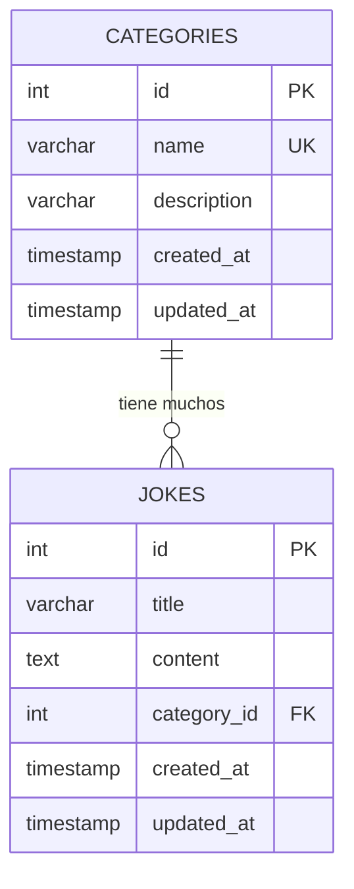

# 📊 Análisis de Base de Datos — Chistes-Nicolas

## Índice

1. [Descripción general](#descripción-general)
2. [Tablas](#tablas)
3. [Diagrama de relaciones](#diagrama-de-relaciones)
4. [Script de creación](#script-de-creación)

---

## Descripción general

La base de datos almacena chistes organizados por categorías. El diseño es sencillo y pensado para escalar si en el futuro se añaden funcionalidades como usuarios, votaciones o favoritos.

**Motor:** PostgreSQL

---

## Tablas

### `categories` — Categorías de chistes

Almacena las categorías disponibles para clasificar los chistes.

| Columna      | Tipo                     | Restricciones             | Descripción                              |
|--------------|--------------------------|---------------------------|------------------------------------------|
| `id`         | `SERIAL`                 | `PRIMARY KEY`             | Identificador único auto-incremental     |
| `name`       | `VARCHAR(100)`           | `NOT NULL`, `UNIQUE`      | Nombre de la categoría                   |
| `description`| `VARCHAR(255)`           |                           | Descripción opcional de la categoría     |
| `created_at` | `TIMESTAMP`              | `DEFAULT CURRENT_TIMESTAMP` | Fecha de creación                      |
| `updated_at` | `TIMESTAMP`              | `DEFAULT CURRENT_TIMESTAMP` | Fecha de última modificación           |

**Ejemplos de categorías:** Humor negro, Dad jokes, Chistes malos, De

, De

, Trabalenguas, etc.

**Índices:**
- `PK` en `id`
- `UNIQUE` en `name` (evita categorías duplicadas)

---

### `jokes` — Chistes

Almacena los chistes con su contenido y la categoría a la que pertenecen.

| Columna       | Tipo                     | Restricciones                          | Descripción                              |
|---------------|--------------------------|----------------------------------------|------------------------------------------|
| `id`          | `SERIAL`                 | `PRIMARY KEY`                          | Identificador único auto-incremental     |
| `title`       | `VARCHAR(200)`           | `NOT NULL`                             | Título o resumen corto del chiste        |
| `content`     | `TEXT`                   | `NOT NULL`                             | El chiste completo                       |
| `category_id` | `INTEGER`                | `NOT NULL`, `FOREIGN KEY → categories(id)` | Categoría a la que pertenece         |
| `created_at`  | `TIMESTAMP`              | `DEFAULT CURRENT_TIMESTAMP`            | Fecha de creación                        |
| `updated_at`  | `TIMESTAMP`              | `DEFAULT CURRENT_TIMESTAMP`            | Fecha de última modificación             |

**Relación:** Cada chiste pertenece a **una categoría** (`category_id`). Una categoría puede tener **muchos chistes** (1:N).

**Índices:**
- `PK` en `id`
- `FK` en `category_id` → `categories(id)` con `ON DELETE RESTRICT` (no se puede borrar una categoría si tiene chistes asociados)
- Índice en `category_id` (optimiza búsquedas por categoría y la consulta aleatoria)

---

## Diagrama de relaciones

```
┌─────────────────────────┐       ┌─────────────────────────────┐
│       categories        │       │           jokes             │
├─────────────────────────┤       ├─────────────────────────────┤
│ id          SERIAL   PK │◄──┐   │ id            SERIAL   PK   │
│ name        VARCHAR(100)│   │   │ title         VARCHAR(200)  │
│ description VARCHAR(255)│   │   │ content       TEXT           │
│ created_at  TIMESTAMP   │   └───│ category_id   INTEGER  FK   │
│ updated_at  TIMESTAMP   │       │ created_at    TIMESTAMP     │
└─────────────────────────┘       │ updated_at    TIMESTAMP     │
                                  └─────────────────────────────┘

Relación: categories (1) ──────── (N) jokes
```

### Diagrama Mermaid



---

## Script de creación

```sql
-- Crear tabla de categorías
CREATE TABLE categories (
    id          SERIAL PRIMARY KEY,
    name        VARCHAR(100) NOT NULL UNIQUE,
    description VARCHAR(255),
    created_at  TIMESTAMP DEFAULT CURRENT_TIMESTAMP,
    updated_at  TIMESTAMP DEFAULT CURRENT_TIMESTAMP
);

-- Crear tabla de chistes
CREATE TABLE jokes (
    id          SERIAL PRIMARY KEY,
    title       VARCHAR(200) NOT NULL,
    content     TEXT NOT NULL,
    category_id INTEGER NOT NULL REFERENCES categories(id) ON DELETE RESTRICT,
    created_at  TIMESTAMP DEFAULT CURRENT_TIMESTAMP,
    updated_at  TIMESTAMP DEFAULT CURRENT_TIMESTAMP
);

-- Índice para optimizar búsquedas por categoría
CREATE INDEX idx_jokes_category_id ON jokes(category_id);

-- Datos iniciales de ejemplo
INSERT INTO categories (name, description) VALUES
    ('Humor negro', 'Chistes de humor oscuro y políticamente incorrectos'),
    ('Dad jokes', 'Chistes de padre: malos pero entrañables'),
    ('Chistes malos', 'Tan malos que dan la vuelta y hacen gracia'),
    ('De

', 'Los

 de

 de toda la vida'),
    ('Informáticos', 'Chistes para

 y

');

INSERT INTO jokes (title, content, category_id) VALUES
    ('El colmo', '¿Cuál es el colmo de un electricista? Que su mujer se llame Luz y sus hijos le sigan la corriente.', 4),
    ('SQL', 'Un programador entra en un bar y pide 1 cerveza, 2 cervezas, 3 cervezas... DROP TABLE cervezas;', 5);
```

---

## Decisiones de diseño

| Decisión | Justificación |
|----------|---------------|
| `ON DELETE RESTRICT` en la FK | Evita borrar categorías con chistes. Primero hay que mover o borrar los chistes. |
| `TEXT` para `content` | Los chistes pueden tener longitudes muy variables. `TEXT` no tiene límite práctico en PostgreSQL. |
| `title` en jokes | Permite identificar rápidamente un chiste en listados sin mostrar el contenido completo. |
| Campos `created_at` / `updated_at` | Trazabilidad básica. Se pueden usar para ordenar por más recientes. |
| Diseño simple (2 tablas) | Suficiente para los requisitos actuales. Fácilmente ampliable (tabla `users`, `favorites`, `votes`) si se necesita en el futuro. |

---

## Posibles ampliaciones futuras

- **Tabla `users`** — Si se añade autenticación
- **Tabla `favorites`** — Relación N:M entre users y jokes
- **Tabla `votes`** — Puntuación de chistes
- **Tags/Etiquetas** — Múltiples etiquetas por chiste (N:M con tabla intermedia)
- **Campo `language`** — Para chistes en varios idiomas
